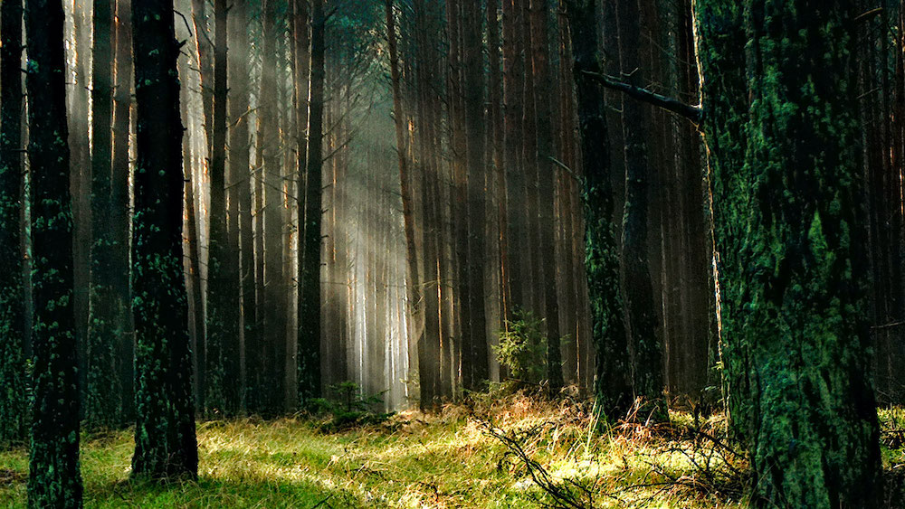

# WebGL-3D-Scene
\
Proyecto final para la materia de Graficas Computacionales.\
Consiste en crear una escena 3D en [WebGL](https://get.webgl.org), con el uso de [Three.js](https://threejs.org).
## Avance 1
La escena a realizar será en base a la siguiente fotografia:

