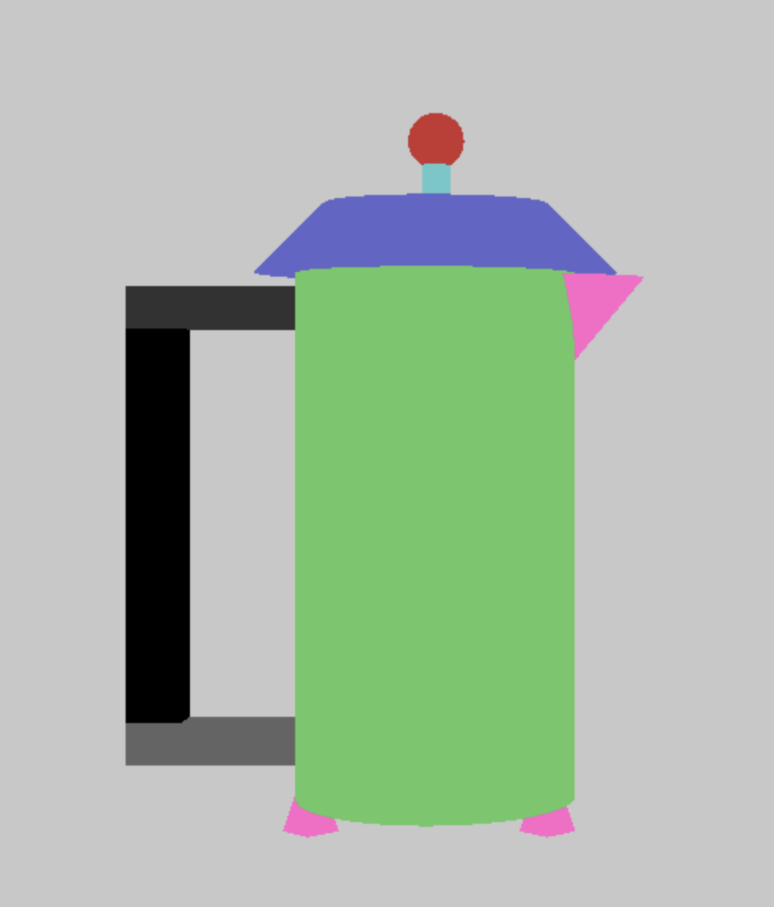
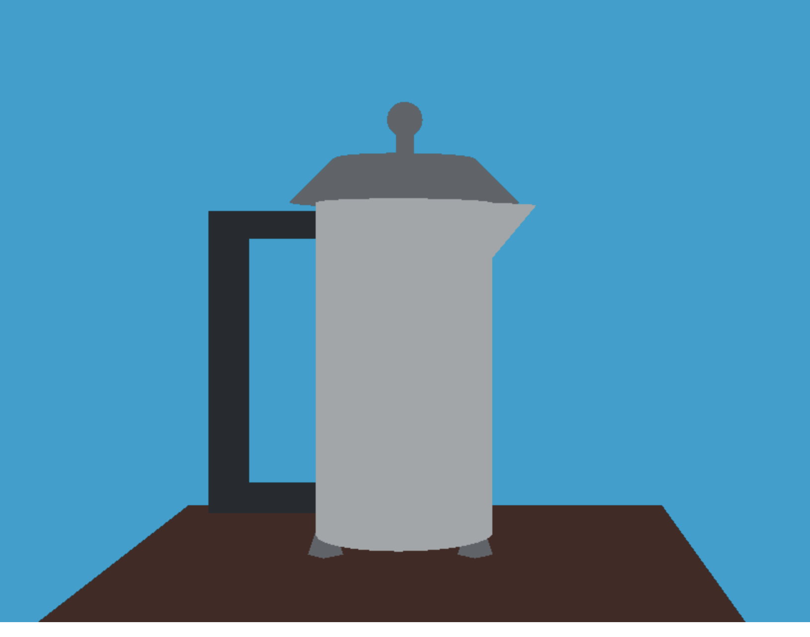
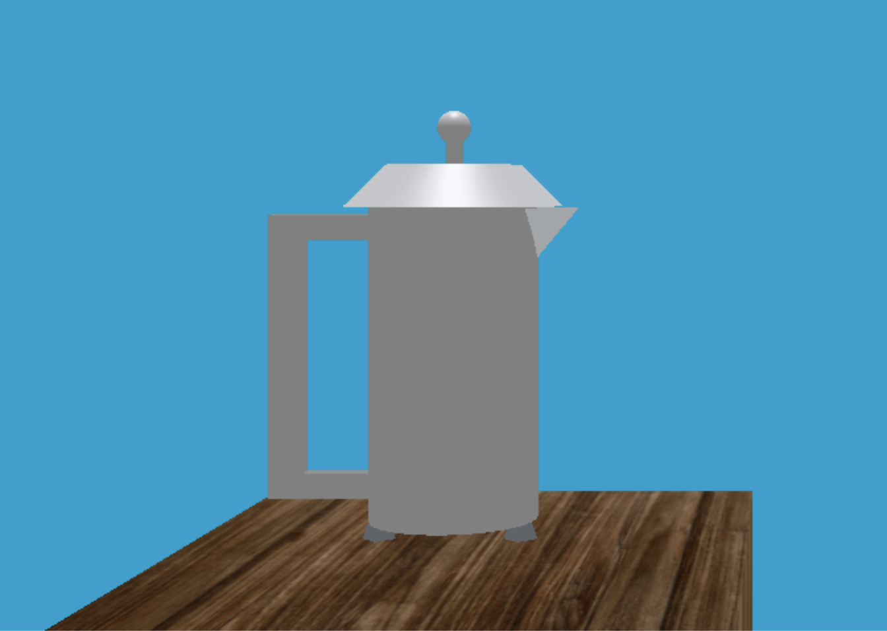

# WebGL-3D-Scene

#### Guillermo Enrique Valles Villegas A01561722
Proyecto final para la materia de Graficas Computacionales.\
Consiste en crear una escena 3D en [WebGL](https://get.webgl.org), con el uso de [Three.js](https://threejs.org).
## Avance 1
#### La escena a realizar será en base a la siguiente fotografia:

#### Vista en figuras primitivas sería asi:

## Avance 2
#### Figuras primitivas creadas y colocadas en base a la figura:

#### Ya con sus colores, la escena termina viendose asi:

## Avance 3
#### Mapeo de texturas y tipos de materiales:

