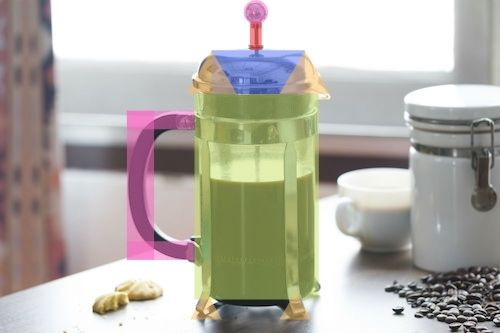

# WebGL-3D-Scene

#### Guillermo Enrique Valles Villegas A01561722
Proyecto final para la materia de Graficas Computacionales.\
Consiste en crear una escena 3D con [Three.js](https://threejs.org).\
La escena es de una prensa francesa que sube y baja para aumentar la cantidad del café.
## Avance 1
#### La escena a realizar será en base a la siguiente fotografia:

#### Vista en figuras primitivas sería asi:

## Avance 2
#### Figuras primitivas creadas y colocadas en base a la figura:

#### Ya con sus colores, la escena termina viendose asi:

## Avance 3
#### Mapeo de texturas y tipos de materiales:

## Escena Final
#### Una vez aplicada la luz y sombras, asi como más detalle a los materiales, la escena terminó así:

### Referencias
- [Documentación de Three.js](https://threejs.org/docs/)
- [Curso de Udemy](https://www.udemy.com/course/3d-programming-with-javascript-and-the-threejs-3d-library/)
- [Creación del vaso estilo vidrio y el café](https://github.com/mrdoob/three.js/issues/644)

